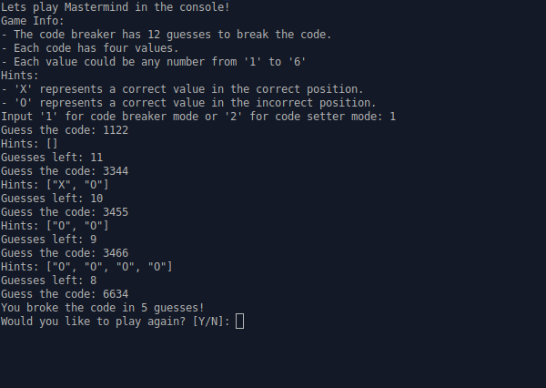

# Mastermind

## Project info 

A command line Mastermind game played against AI. The purpose of this project was to practice Object Oriented Programming (OOP).

Project description can be found [here](https://www.theodinproject.com/lessons/ruby-mastermind).

## Game info

When the game starts, the player may choose to play as the "code setter" or "code breaker". The "code setter" creates a 4 peg code from 6 different color pegs that form that the "code breaker" tries to solve within 12 guesses. After each guess, the "code breaker" receives feedback on the number of pegs that were the correct color and if correct color pegs are also in the correct spot. For this game, I have assigned numbers 1-6 to the colored pegs, so the user only needs to input those numbers to enter or guess the code.

## Live demo

Live demo available [on Replit (account required)](https://replit.com/@jcampbell57/FirmGullibleSystems#main.rb)

## Table of Contents

* [Technologies utilized](#technologies-utilized)
* [Learning outcomes](#learning-outcomes)
* [Project screenshot](#project-screenshot)
* [Behind the Scenes](#behind-the-scenes)
* [Installation](#installation)

## Technologies utilized

- Ruby

## Learning outcomes

This project helped to reinforce the following skills:

- Object Oriented Programming (OOP)
- basic Ruby knowledge
- using a Linter and RuboCop

## Project screenshot

## Behind the scenes

### Improvements

This project could be improved with:

- add colors to terminal output/number choices

## Installation

- Clone this repository to your desktop.
- Navigate to the top level of the directory by running `cd ruby_mastermind`.
- Run `ruby main.rb` in your terminal.
